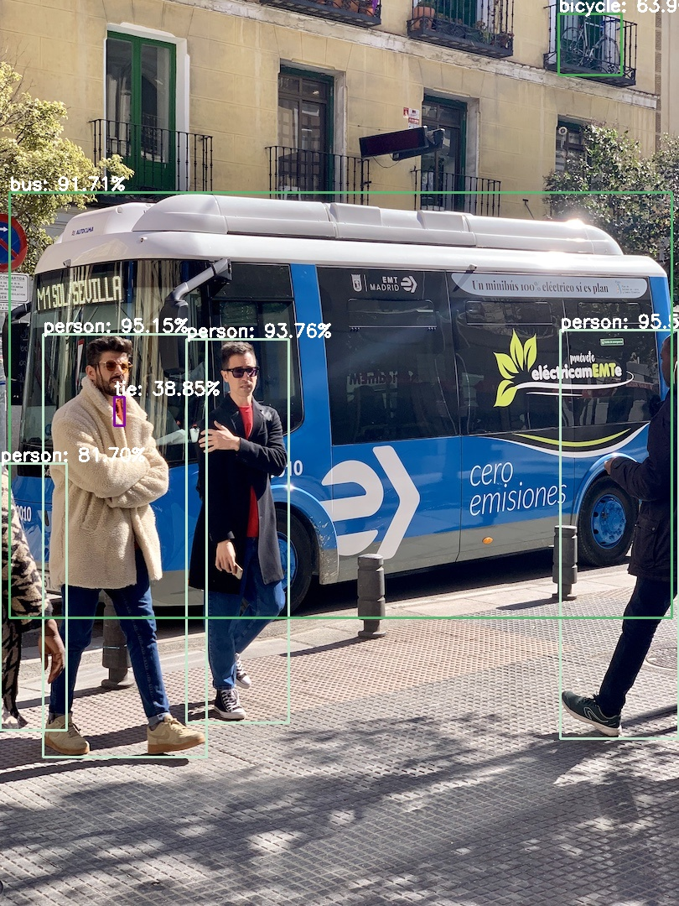
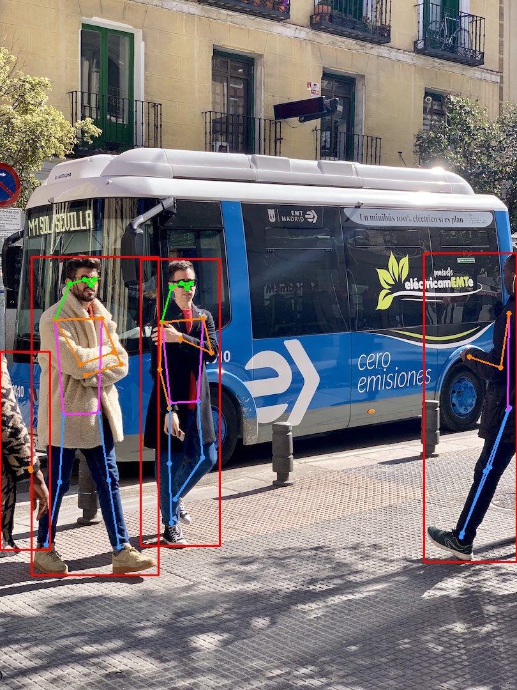
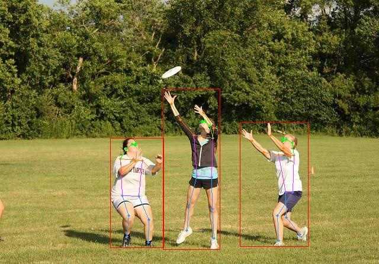

## ONNX files downloaded

[Click here to download](http://pan.halashuo.cn/?dir=data/ONNX)

## Configure the environment

This project mainly uses onnx runtime and openCV.

Please copy the opencv_java460.dll generated by the openCV installation to the `C:\Windows\System32` folder before using this project, otherwise `no opencv_java460 in java.library.path` errors will be generated.

## Predict the outcome

### Object Detection

### Pose Estimation

